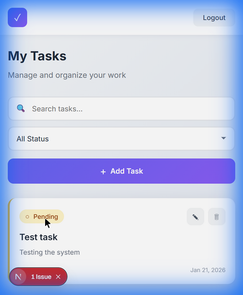

# Task Management System

A full-stack task management application built with **Node.js/TypeScript** backend and **Next.js** frontend.

## Features

- 🔐 **Authentication** - JWT-based login/register with access & refresh tokens
- ✅ **Task Management** - Create, edit, delete, and toggle task status
- 🔍 **Search & Filter** - Search by title and filter by status
- 📱 **Responsive Design** - Modern UI that works on all devices
- 🎨 **Beautiful UI** - Gradient design with smooth animations

## Tech Stack

### Backend
- Node.js + Express.js
- TypeScript
- Prisma ORM + SQLite
- JWT Authentication
- bcrypt for password hashing

### Frontend
- Next.js 14 (App Router)
- TypeScript
- CSS Modules
- React Context for state management

## Getting Started

### Prerequisites
- Node.js 18+ installed
- npm or yarn

### Backend Setup

```bash
cd backend
npm install
npx prisma db push
npm run dev
```

The backend will run on http://localhost:3001

### Frontend Setup

```bash
cd frontend
npm install
npm run dev
```

The frontend will run on http://localhost:3000

## API Endpoints

### Authentication
- `POST /auth/register` - Register new user
- `POST /auth/login` - Login user
- `POST /auth/refresh` - Refresh access token
- `POST /auth/logout` - Logout user

### Tasks (Protected)
- `GET /tasks` - Get all tasks (with pagination, filtering, search)
- `POST /tasks` - Create new task
- `GET /tasks/:id` - Get single task
- `PATCH /tasks/:id` - Update task
- `DELETE /tasks/:id` - Delete task
- `POST /tasks/:id/toggle` - Toggle task status

## Screenshots



## License

MIT
